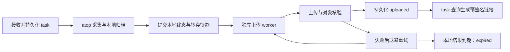

# S3 结果转存设计

2026-09-22。Q1–Q14 及整体方案已获用户确认并授权实施；本文件为设计依据。实现及验证证据见 [S3 验证](../s3-validation.md)，配置与实际响应约定见 [配置说明](../../configs/README.md#s3-结果转存)。

## 已确认目标和范围

- Q1：解决办公网无法直接访问线上主机采集数据的场景。线上结果转存到 S3 后，调查方可在可达的网络中读取并分析。
- Q2：支持 S3 兼容接口，可配置 endpoint、region、bucket、对象前缀；具体服务商和部署地址尚未给定。
- Q3：上传每个可下载的最终 `tar.gz`，包括包含有效证据的 `partial`、`interrupted` 结果。后台历史随任务归档上传。
- Q4：采集请求可以由用户自行发送，也可以由中间 server 发送；沿用 agent 的 HTTP 任务接口，发起方需具备访问该接口的网络路径。
- Q5：agent 只负责将结果上传并返回链接。办公网如何取得链接、如何访问远程存储由调用方处理，不在本项目范围内；不要求实现结果检索或办公侧下载客户端。
- Q6：先完成本地采集归档，再异步转存；采集状态与上传状态分别记录。上传失败保留本地归档并自动重试。架构依据见 `docs/adr/0003-asynchronous-result-transfer.md`。
- Q7：上传成功后，在 task 查询响应中返回私有对象的预签名 HTTPS 下载链接和过期时间，默认有效 1 小时；查询时可重新生成链接。
- Q8：在本地结果保留期内退避重试，重启后继续；默认任务结束后 24 小时仍未上传成功，标记转存过期并停止重试，按原有本地保留规则清理。用户接受长期上传失败可能最终失去唯一副本。
- Q9：远程对象保留与删除由 bucket 生命周期管理；agent 的本地文件与任务记录过期不联动删除远程对象。
- Q10：S3 连接参数与上传凭据在 YAML 中配置，支持 access_key_id、secret_access_key、可选 session_token。凭据配置不进入 task、归档或日志，secret_access_key 不得出现在任何响应或链接中。预签名链接本身属于临时访问凭证；使用临时凭据时，链接实际可用期还受该凭据有效期限制。
- Q11：新增 s3.enabled，默认 false；开启后新任务记录持久化转存意图，重启继续未到期上传，包含恢复生成的 interrupted 结果。已有任务不自动补传；有效可下载的 failed 错误证据包也上传。关闭开关暂停上传，原截止时间继续生效。
- Q12：保留本地 result 下载语义，新增 result.s3；上传成功后本地仍按原 TTL 保留。本地结果过期后，任务记录有效期内仍可签发已上传对象的链接；任务记录过期后查询返回 404。
- Q13：独立单并发流式上传，上传期间持有文件租约且仍计入本地配额。单次默认限时 2 分钟，失败后从 5 秒指数退避至最多 5 分钟并加入抖动，受本地结果截止时间约束。网络等待不占用采样执行器。
- Q14：预先创建的私有 bucket、HTTPS 与证书校验、可配置 region/path-style，默认 path-style。对象身份固定关联 agent/task/归档摘要，重试使用同一对象；保留长度和 SHA-256 校验信息，不将 ETag 当作 SHA-256，目标变更不静默迁移已有任务。
- 本功能沿用项目边界：只实现 agent，证据仍来自 atop；分析由外部调用方完成。
- 领域术语“结果转存”已补入根目录 `CONTEXT.md`。

## 当前实现事实

- `internal/agent/archive.go` 先生成本地临时归档，再发布 `tasks/<task_id>/result.tar.gz`；任务结果带长度及 SHA-256。
- `internal/agent/types.go` 的 `Result` 目前只有本地结果可用性、过期标记、HTTP URL、SHA-256 和大小，未提供远程位置或上传状态。
- 当前访问结果的方式是 agent HTTP 下载。办公网无法连接 agent 时，仅增加一个同样指向 agent 的下载地址无法满足需求。
- 当前本地结果保留默认 24 小时，任务与幂等记录保留默认 7 天；远程转存必须明确与本地过期、重启和配额的关系。
- 当前服务使用专用非 root 账号，允许 IPv4/IPv6/Unix socket；S3 对实际部署网络的可达性仍需验证。
- 现有本地下载使用文件租约，下载期间文件清理延期且字节仍计入预算；上传期间可以复用该保护机制。
- 当前采集、后台会话与清理共用串行执行器。后续上传执行方式必须避免网络等待阻塞采样与清理。

## 配置

新增顶层 `s3`，沿用启动时加载、严格字段检查、重启生效的方式。缺失该段或默认关闭时，新任务保持原有本地存储行为。示例 endpoint、bucket 和凭据均为占位值：

```yaml
s3:
  enabled: false
  endpoint: "https://s3.example.com"
  region: "us-east-1"
  bucket: "deitysight-results"
  prefix: "deitysight"
  force_path_style: true
  access_key_id: "REPLACE_WITH_ACCESS_KEY_ID"
  secret_access_key: "REPLACE_WITH_SECRET_ACCESS_KEY"
  session_token: ""
  presign_ttl: "1h"
  upload_timeout: "2m"
  retry_initial: "5s"
  retry_max: "5m"
```

- 启用时检查必填项、占位符、HTTPS URL、前缀及正时长；retry_max 不得小于 retry_initial。endpoint 不接受内嵌用户信息、查询参数或片段，对象路径由 SDK 按 bucket/key 构造。
- region 必须匹配实际 S3 服务的签名要求；force_path_style 默认 true，也支持 virtual-hosted-style。
- 必须验证 TLS 证书；企业 CA 使用部署环境的可信证书配置，不通过跳过验证解决问题。
- 按 YAML 显式使用凭据，不默默使用机器上的其他 AWS 身份。配置文件沿用专用账号可读的 root:deitysight 0640 建议权限。
- presign_ttl 默认 1h，最大不得超过 SigV4 服务限制（AWS 为 7 天）。session_token 对应的临时凭据可能更早过期；响应中的 url_expires_at 表示签名的到期上限，不承诺凭据此前始终有效。
- 配置格式错误时启动失败；合法配置对应的 S3 暂时不可达时，仍提供采集、查询及本地下载，由上传状态报告问题。
- 维持现有 systemd/seccomp 沙箱；部署方需保证 DNS、CA 和目标 HTTPS endpoint 可达。

## 任务与对象身份

接收新任务时，将转存意图和不含秘密的目标身份持久化：endpoint、region、bucket、prefix、寻址模式。task 请求不能指定上传目标、凭据、任意对象 key 或下载路径。

对象 key 在归档发布后确定：

```text
<prefix>/<agent_id>/<task_id>/<archive_sha256>.tar.gz
```

agent_id 使用现有持久身份，task_id 使用现有 UUID，摘要来自原归档字节。前缀为空时省略相应分隔符，不允许父路径穿越段；request_id 等任意用户输入不直接拼入 key。

重试使用同一 key。若 bucket 开启版本控制，重复 PUT 仍可能产生对象版本；不能把固定 key 描述为服务端 exactly-once，版本治理仍属于 bucket 策略。

已有任务不因配置变更自动迁移目标。首版只配置一个 S3 目标，目标配置不匹配时暂停旧任务上传或签名并给出原因；恢复匹配配置后继续未到期任务。凭据轮换不改变对象身份。

## 异步流程与状态



采集状态仍为 running/completed/partial/failed/interrupted，上传失败不改变采集结局。只有本地归档及任务终态都成功提交，且归档可验证、未过期，才可执行上传。failed 若没有归档，仅报告远端结果不可用。

| result.s3.state | 含义 |
| --- | --- |
| waiting_result | 有转存意图，等待最终本地归档 |
| pending | 归档已提交，等待上传 |
| uploading | 正在上传或核验远端对象 |
| retry_wait | 上次失败，等待 next_attempt_at |
| uploaded | 上传、对象核验与本地成功记录已提交 |
| expired | 到本地截止时间仍未确认成功，停止重试 |
| unavailable | 没有可上传归档，或本地归档损坏/缺失 |

关闭开关、目标配置不匹配等暂停情况用 paused 与 last_error_code 表达，不丢失原状态或截止时间。旧任务和未启用转存的新任务省略 result.s3，缺失字段不触发补传。

独立单 worker 流式读取原归档，不重新采集或压缩，不持有任务管理全局锁执行网络 I/O。失败待办退避后让出执行机会，不阻塞其他任务；尝试预算取 upload_timeout 和剩余本地保留时间的较小值，包含上传、发布及核验，SDK 内部重试也受该预算约束。

上传期间持有文件租约，未释放本地字节仍计入总预算；缓冲必须有界。采样、上传仍共用服务 CPU/内存配额，异步不代表没有资源竞争。

## 完整性与恢复

- 上传前验证本地归档的长度和完整 SHA-256，转存原始字节，Content-Type 为 application/gzip。对象保存 agent_id、task_id、完整归档 SHA-256 等非秘密元信息。
- 使用 SDK/服务支持的请求校验能力；上传后核对远端长度、对象身份及摘要信息。自定义 SHA-256 metadata 匹配只证明声明一致，不等于重新计算远端对象内容哈希；下载方仍可用返回的完整 SHA-256 校验归档。
- S3 ETag 不作为 SHA-256。multipart 的 ChecksumSHA256 可能为 composite checksum，也不能直接与完整归档 SHA-256 比较。必须区分校验算法、类型和实际服务能力。
- 上传已完成但本地尚未提交 uploaded 时崩溃：重启后按固定 key 核对远端对象，身份、长度、摘要声明一致可补记成功。明确发现冲突时报告 object_conflict，不盲目覆盖；HEAD 返回 403 视为权限/未知状态，不当作对象不存在。
- 原任务采集期间中断时，沿用 interrupted 恢复；对具有转存意图的任务，在恢复归档发布后安排上传，不补采、不延长 TTL。
- 单次 PutObject 在 AWS 的上限是 5 GB；本地容量配置可调大，不能依靠默认 1 GiB 预算来假定所有归档永远适合单 PUT。实现应使用支持有界 multipart 的 SDK 上传路径，并验证实际兼容服务的大小限制。
- 使用 multipart 时限制分片并发和内存，持久化 upload_id；失败、取消及重启恢复时停止在途操作并尝试中止旧上传。中止可能需要重试和 ListParts 核验；崩溃残留由 bucket 的 AbortIncompleteMultipartUpload 生命周期规则兜底。
- 关闭 S3 开关暂停上传，原截止时间继续推进；重新开启后继续未到期待办。已有成功对象信息保留，有匹配的可用签名配置时才能生成链接。
- 上传状态持久化失败不能伪称上传已确认可用；重启以持久化记录恢复。任务元数据损坏沿用既有 degraded 规则。

## 保留、配额与清理

本地 result_retention 默认 24h，task_retention 默认 168h，沿用现有起算点。上传成功不刷新 TTL，也不立即删除本地文件。

待上传、暂停和租约期间的所有本地文件都计入既有磁盘约束。容量不足时继续按原规则返回 507 拒绝新采集；不提前删除未过期结果，也不为待上传证据无限延长保留时间。

本地结果到期后取消未完成尝试、释放租约、记录 expired，并按清理周期删除附件。取消请求时远端可能已经完成但响应未返回，不能保证远端必然没有对象；该对象仍由 bucket 策略管理。下载期间的租约继续遵循既有本地下载规则。

agent 不因本地 TTL 执行 DeleteObject。远端对象可能比本地任务记录存活更久，也可能被外部生命周期或管理员提前删除；uploaded 是转存成功记录，不保证每次查询时对象仍存在。

## HTTP 响应与链接

POST /v1/tasks 继续异步返回 202；幂等重放返回原任务，不生成第二份转存待办。调用方经原 GET /v1/tasks/{task_id} 查询上传状态。以下 URL 中的签名为占位文字：

```json
{
  "task_id": "<uuid>",
  "state": "completed",
  "result": {
    "available": true,
    "expired": false,
    "url": "/v1/tasks/<uuid>/result",
    "sha256": "<archive-sha256>",
    "size": 2468912,
    "s3": {
      "state": "uploaded",
      "paused": false,
      "bucket": "deitysight-results",
      "key": "deitysight/<agent-id>/<task-id>/<archive-sha256>.tar.gz",
      "sha256": "<archive-sha256>",
      "size": 2468912,
      "attempts": 1,
      "uploaded_at": "2026-09-22T04:00:00Z",
      "url": "https://s3.example.com/deitysight-results/...?<signature>",
      "url_expires_at": "2026-09-22T05:00:00Z"
    }
  }
}
```

上传成功前不返回远端链接；失败返回脱敏 last_error_code、next_attempt_at。签名只在已鉴权响应中生成，不写入 task.json、manifest 或日志。签名失败保留 uploaded 事实但省略 URL，返回 url_error_code；SDK 原始错误、签名 URL、请求头不得进入日志。

GET /v1/tasks/{task_id}/result 保留本地鉴权、租约、校验和 409/410/404 语义，不代理或重定向 S3。本地结果过期后 local available=false/expired=true；任务记录仍有效且已上传成功时，查询仍可生成远端 URL。任务记录到期返回 404，不再由 agent 刷新链接。

endpoint 用于上传和签名 URL，调用方负责对应可达性，不能在签名后随意替换域名。凭据过期、策略变更、对象删除均可能使链接早于 url_expires_at 失效。

## 实施、迁移与验收

实施范围为配置、独立 S3 客户端与 worker、任务持久化/恢复、状态响应、文档及测试。采用维护中的 Go S3 SDK，新增依赖按仓库 vendor 方式锁定，不手写签名算法；选定版本的 API 与行为需再核对。旧 task.json 按原语义恢复，既有归档保持原字节与 SHA-256。

部署方准备 bucket、生命周期、凭据、网络和证书，agent 不自动创建桶或修改桶策略。所需权限涵盖上传、HEAD 对象核验、签名 GET 和实际使用的 multipart/中止操作；不需要删除已完成对象的权限。缺少 ListBucket 可能使 HEAD 的不存在状态表现为 403，实际权限策略需随 SDK 请求验证。

验收要求：

1. 默认关闭兼容既有配置和本地 API；开启后只处理具有转存意图的新任务，旧任务不补传。
2. 各种终态的有效归档均可转存，无归档/损坏文件不返回成功链接。
3. 上传和下载的归档字节一致、SHA-256 可重算；大归档内存有界，单并发生效，S3 不可达不阻塞采样。
4. 模拟超时、认证失败、5xx、对象冲突，验证错误脱敏、退避、公平调度、尝试期限及截止时间。
5. 在待上传、上传中、远端已完成但本地未提交的位置重启，验证恢复、固定对象身份及 multipart 清理。
6. 到期停止重试并释放租约，占用未释放前仍计入配额；本地清理不删除远端对象。
7. 已鉴权查询生成预签名 HTTPS URL，测试实际 GET；确认 URL/秘密不进入落盘元数据、归档或日志。
8. 本地 410 与任务记录有效期内的 S3 链接可同时成立；任务记录过期维持 404。
9. 关闭/重开、凭据轮换、目标变更不造成静默迁移、批量补传或无限保留。
10. 在可控 HTTPS S3 服务验证 PutObject/HEAD/GET、预签名、原生 checksum、multipart；实际部署服务信息提供后再联调，不宣称所有 S3 兼容实现均已验证。

实际服务商、endpoint、bucket 与凭据是部署输入，不在设计阶段索取真实秘密；缺少它们不妨碍本地实现与可控集成测试，但限制实际目标服务的联调证据。

## S3 语义核查依据

以下为本次实际读取的 AWS 官方文档；说明 AWS 行为，不构成对所有兼容服务的承诺：

- [对象上传与单 PUT 限制](https://docs.aws.amazon.com/AmazonS3/latest/userguide/upload-objects.html)
- [上传完整性及 ETag](https://docs.aws.amazon.com/AmazonS3/latest/userguide/checking-object-integrity-upload.html)
- [HeadObject、checksum 类型与权限](https://docs.aws.amazon.com/AmazonS3/latest/API/API_HeadObject.html)
- [对象自定义元数据](https://docs.aws.amazon.com/AmazonS3/latest/userguide/UsingMetadata.html)
- [预签名 URL 与临时凭据](https://docs.aws.amazon.com/AmazonS3/latest/userguide/using-presigned-url.html)
- [Multipart 行为](https://docs.aws.amazon.com/AmazonS3/latest/userguide/mpuoverview.html)
- [AbortMultipartUpload 的在途操作限制](https://docs.aws.amazon.com/AmazonS3/latest/API/API_AbortMultipartUpload.html)
- [未完成 multipart 生命周期清理](https://docs.aws.amazon.com/AmazonS3/latest/userguide/mpu-abort-incomplete-mpu-lifecycle-config.html)

产品决策已收口，用户已确认完整方案并明确要求实施。
